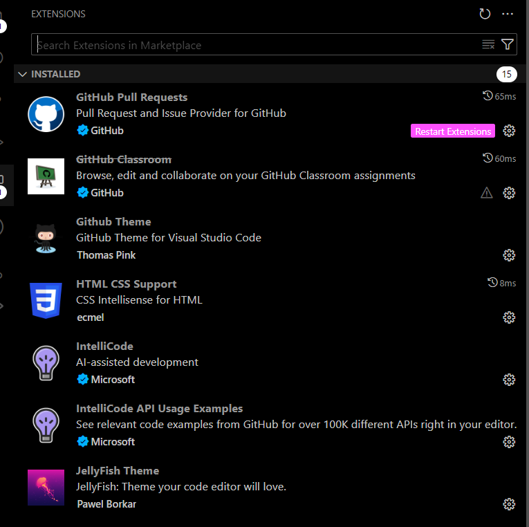

[](https://classroom.github.com/a/vbnbTt5m)
[](https://classroom.github.com/online_ide?assignment_repo_id=15283760&assignment_repo_type=AssignmentRepo)
# Dev_Setup
Setup Development Environment

#Assignment: Setting Up Your Developer Environment

#Objective:
This assignment aims to familiarize you with the tools and configurations necessary to set up an efficient developer environment for software engineering projects. Completing this assignment will give you the skills required to set up a robust and productive workspace conducive to coding, debugging, version control, and collaboration.

#Tasks:

1. Select Your Operating System (OS):
   Choose an operating system that best suits your preferences and project requirements. Download and Install Windows 11. https://www.microsoft.com/software-download/windows11
   System instaled - Windows 11 Pro available at (https://www.microsoft.com/software-download/windows11)
   Download: Go to the official Microsoft website and download the Windows 11 Installation Assistant.
   Run: Open the downloaded file and follow the instructions. The assistant will guide you through the process of downloading and installing Windows 11.

2. Install a Text Editor or Integrated Development Environment (IDE):
   Select and install a text editor or IDE suitable for your programming languages and workflow. Download and Install Visual Studio Code. https://code.visualstudio.com/Download
   Install VS Code:
   Visit the official VS Code website: https://code.visualstudio.com/download
   Select the installer for your operating system (Windows, macOS, or Linux).
  Windows: Choose between "User Installer" (recommended for most users) or "System Installer" (for all users on the machine).
  Windows:
  Double-click the downloaded installer file (e.g., VSCodeUserSetup-x64-1.xx.x.exe).
  Follow the on-screen instructions. You can usually accept the default settings.

3. Set Up Version Control System:
   Install Git and configure it on your local machine. Create a GitHub account for hosting your repositories. Initialize a Git repository for your project and make your first commit. https://github.com
Windows: Download and install Git for Windows from the official website: https://git-scm.com/download/win. Follow the installer's instructions.
 Configure Git:
Open your terminal (Git Bash on Windows).
Set your global Git username and email:
git config --global user.name "Your Name"
git config --global user.email "your@email.com" 
Replace "Your Name" and "your@email.com" with your actual name and email address.
Create a GitHub Account:
Go to https://github.com/ and click "Sign up."
Follow the instructions to create your account.
Initialize a Git Repository:
Navigate to Your Project: In your terminal, change the directory to the folder where your project is located.
Initialize: Run the following command to create a new Git repository in that folder:
Bash
git init
Make Your First Commit:
Stage Changes: Add the files you want to track in Git to the staging area. You can use the following command to add all files:
Bash
git add .
Commit: Create a commit with a descriptive message to record the changes you've made:
Bash
git commit -m "Initial commit"
.gitignore: Create a .gitignore file in your project's root directory to exclude files and folders that you don't want to track in Git (e.g., temporary files, build output).


4. Visit the Python website and navigate to the downloads section: https://www.python.org/downloads/
Choose the Python version you want to install. The latest stable version is Python 3.12.3.
Download the Python installer for your operating system.
Run the Python installer and follow the on-screen instructions.
Once Python is installed, you can verify that it is working by opening a command prompt or terminal and typing python --version. This should print the version of Python that you have installed.
Here are some additional tips for installing Python:
If you are unsure which version of Python to install, the latest stable version is always a good choice.
You can also install multiple versions of Python on your system. This can be useful if you need to use different versions of Python for different projects.
If you are having trouble installing Python, you can consult the Python documentation or search for help online.
5. Install Package Managers:
   If applicable, install package managers like pip (Python).
System-Level Package Managers:
Windows:
Winget: The official Windows package manager. Install it from the Microsoft Store or their GitHub page.
Chocolatey: A popular third-party package manager for Windows. Follow the installation instructions on their website.
Python (pip):
Typically included with Python installations.
If not, run python -m ensurepip --upgrade (or python3 -m ensurepip --upgrade for Python 3).

6. Configure a Database (MySQL):
   Download and install MySQL database. https://dev.mysql.com/downloads/windows/installer/5.7.html

Download and Install MySQL:

Visit the MySQL website:** Go to the MySQL Downloads page: [https://www.mysql.com/downloads/](https://www.mysql.com/downloads/)
Choose Your Operating System:** Select the version that matches your operating system (Windows, macOS, or Linux).
Download MySQL Community Server:** This is the free and open-source version.
Follow the Installation Instructions:** Run the installer and follow the on-screen prompts. You can usually accept the default settings.

Secure MySQL Installation (Important):**

* After installation, run the MySQL Secure Installation tool. You'll find it in your Start Menu (Windows) or you can run it from the command line.
* This tool guides you through:
    * Setting a root password
    * Removing anonymous users
    * Disabling remote root login
    * Removing test databases

Start the MySQL Server:**

Windows:** The MySQL server usually starts automatically. You can check its status in the Services panel.

Connect to MySQL:**

Open a Terminal:** (Command Prompt on Windows, Terminal on macOS/Linux).
Connect:** Use the following command, replacing `your_root_password` with the password you set during installation:
   ```bash
   mysql -u root -p
   ```
   You'll be prompted to enter your password.

Basic Configuration (Optional):**

Inside the MySQL shell, you can perform additional configuration tasks:
    * Create new databases: `CREATE DATABASE mydatabase;`
    * Create new users: `CREATE USER 'newuser'@'localhost' IDENTIFIED BY 'password';`
    * Grant privileges to users: `GRANT ALL PRIVILEGES ON mydatabase.* TO 'newuser'@'localhost';`

GUI Tools (Optional):**

* MySQL Workbench: A visual tool for designing, managing, and administering MySQL databases. 
* Other options include phpMyAdmin, Sequel Pro, and DBeaver.

Important Considerations:**

Firewall:** If you plan to access your MySQL server from other machines, make sure to configure your firewall to allow connections on port 3306 (the default MySQL port).
Remote Access:** Be cautious about enabling remote access to your MySQL server, especially if it's not behind a firewall or other security measures.
Backups:** Regularly back up your databases to prevent data loss.

Creating a Database and User**

1. Connect:** `mysql -u root -p`
2. Create Database:** `CREATE DATABASE myproject;`
3. Create User:** `CREATE USER 'projectuser'@'localhost' IDENTIFIED BY 'securepassword';`
4. Grant Privileges:** `GRANT ALL PRIVILEGES ON myproject.* TO 'projectuser'@'localhost';`
5. Exit:** `quit;`


7. Set Up Development Environments and Virtualization (Optional):
   Consider using virtualization tools like Docker or virtual machines to isolate project dependencies and ensure consistent environments across different machines.

8. Explore Extensions and Plugins:
   Explore available extensions, plugins, and add-ons for your chosen text editor or IDE to enhance functionality, such as syntax highlighting, linting, code formatting, and version control integration.


9. Document Your Setup:
    Create a comprehensive document outlining the steps you've taken to set up your developer environment. Include any configurations, customizations, or troubleshooting steps encountered during the process. 

 10. Challenges

Installing Git and Configuring GitHub:**

Challenge:** Incorrect configuration of SSH keys can lead to authentication errors when pushing to GitHub.
Solution:** Double-check that you've followed the instructions for generating and adding SSH keys to your GitHub account correctly.

Installing Package Managers:**

Challenge:** Dependency conflicts can arise when different projects require different versions of the same package.
Solution:** Utilize virtual environments (`venv` or `virtualenv` in Python, for example) to isolate project dependencies.

Installing Programming Languages and Runtimes:**

Challenge:** Incorrect environment variables can cause the system to not find the installed language or runtime.
Solution:** Verify that the PATH environment variable includes the correct directories for your language/runtime executables.

Configuring a Database (MySQL):**

Challenge:** Firewall configurations might block access to the database server.
Solution:** Open the necessary port (3306 by default) in your firewall settings.
Challenge:** Setting insecure root passwords or failing to remove anonymous users can create security vulnerabilities.
Solution:** Always use strong passwords and follow MySQL's secure installation recommendations.

Setting Up Development Environments and Virtualization:**

Challenge:** Docker can be resource-intensive, especially on machines with limited resources.
Solution:** Optimize Docker settings, such as allocating more memory and CPU resources, and use lighter-weight base images where possible.
Challenge:** Conflicts between the host and container environments (e.g., port clashes) can disrupt development.
Solution:** Carefully map ports and manage shared resources between the host and container.

General Challenges and Tips:

Documentation:** Thoroughly read the official documentation for each tool and technology.  It often contains the most accurate and up-to-date information on installation and troubleshooting.
Community Support:** Online forums, Stack Overflow, and community resources can be invaluable when you encounter problems.
Version Compatibility:** Pay attention to version compatibility between different tools and libraries. Incompatible versions can cause unexpected errors.
Backups:** Regularly back up your project code and databases to safeguard against data loss due to unexpected issues.

*
By being aware of these potential challenges and following the recommended solutions, you can streamline your development environment setup and focus on building your projects.


#Deliverables:
- Document detailing the setup process with step-by-step instructions and screenshots where necessary.
- A GitHub repository containing a sample project initialized with Git and any necessary configuration files (e.g., .gitignore).
- A reflection on the challenges faced during setup and strategies employed to overcome them.

#Submission:
Submit your document and GitHub repository link through the designated platform or email to the instructor by the specified deadline.

#Evaluation Criteria:**
- Completeness and accuracy of setup documentation.
- Effectiveness of version control implementation.
- Appropriateness of tools selected for the project requirements.
- Clarity of reflection on challenges and solutions encountered.
- Adherence to submission guidelines and deadlines.

Note: Feel free to reach out for clarification or assistance with any aspect of the assignment.
